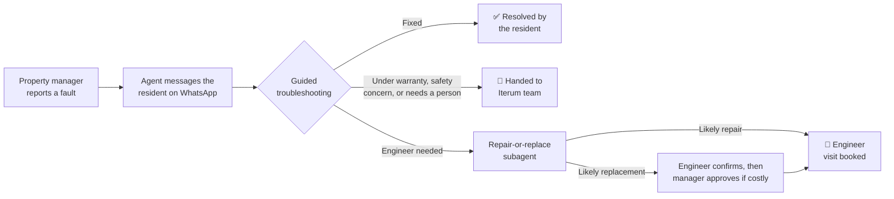

# Iterum Issue Resolution Agent

An AI agent that handles broken-appliance reports in rented homes, built as a working prototype for Iterum, a company that repairs and replaces appliances for property managers.

## The problem

When an appliance breaks in a rented home, nobody in the chain knows what's actually wrong with it. An engineer often has to visit just to diagnose the fault, sometimes followed by a second visit to fix it. Many of those visits could have been avoided by a two-minute check the resident could do themselves, and the ones that are needed are often booked without the information the engineer needs to fix it first time.

This agent sits between the property manager's report and the engineer's van. It talks to the resident over WhatsApp, walks them through safe checks, and ends every issue in one of three places: **fixed by the resident**, **an engineer visit booked**, or **handed to a person at Iterum**.

This is a prototype. Every outside system (WhatsApp, Iterum's platform, email) is simulated, and the resident is played by a second AI model that knows the true fault while the agent doesn't.

## How an issue flows



## The repair-or-replace subagent

Once troubleshooting shows an engineer is needed, someone has to judge whether the visit is likely a repair or a replacement, and how confident that judgement is. The answer matters: a confident repair is booked straight away, while a likely replacement waits for an engineer (and, above a cost limit, the property manager) to approve it.

A **subagent** is a separate AI worker with its own instructions, its own limited information and its own tools, which does one job and hands back a result. The main agent runs the conversation; the subagent only makes this one judgement.

**Why it needed to be separate.** In an earlier version, this judgement was a separate AI call, but its answer passed back through the main agent before being recorded. In one test, a resident reported cracked hob glass but couldn't send a photo. The assessment said "likely replace" with a confidence of 0.6 out of 1, deliberately held down because the rules require a photo to confirm a crack. The main agent recorded 0.78 instead, crossing the 0.7 line below which the engineer is warned that the call is uncertain. Over the conversation, the main agent had formed its own view, and that view leaked into the result.

That one failure shows the three reasons for a subagent:

1. **Independent reasoning.** The judgement should come from the evidence alone, not from a conversation that has been heading towards a conclusion.
2. **A clean, filtered brief.** It should see the facts about the fault, not the whole conversation, the resident's frustration or the main agent's opinion.
3. **An answer no one can change.** Its result should reach the record exactly as given.

Loading the same rules into the main agent wouldn't achieve any of this, because they would still be applied inside the main agent's crowded, opinionated context.

## Key design decisions

- **The subagent's answer is final.** The main agent can only pass the answer on by reference; it has no way to type in its own recommendation or confidence.
- **The brief contains the resident's exact words, not a summary.** Code rejects any quote that isn't word-for-word or that contains a verdict. An earlier "summary of the fault" field was removed because the only thing it added was the main agent's interpretation.
- **The main agent can't build its own case.** The lookup of similar past jobs was taken away from the main agent and given only to the subagent.
- **Humans approve every replacement.** Repairs are booked automatically; a likely replacement is held until the engineer confirms it, and the property manager approves it above a cost limit. This is enforced by the system, not by asking the AI nicely, and the check reads the subagent's recommendation rather than how the main agent labels the booking.
- **Missing evidence limits confidence.** When key evidence is missing, such as a photo of a crack, the rules set a ceiling on how confident the judgement can be, and code holds confidence to any ceiling the subagent reports.
- **Second opinions, with limits.** If the resident later says something new about the fault, the subagent is asked again, without seeing its previous answer so it can't simply defend it. It first decides whether the new information could change the judgement at all. After two re-assessments, the issue goes to a person.
- **A backup that knows it's a backup.** If the AI assessment fails, a simple set of rules based on age and cost steps in. Its answers are always treated as uncertain, and the engineer is told they came from the backup.
- **Spec before code.** Every decision above was written down before building, so choices couldn't drift during long build sessions.

## What testing showed

Scenarios were run repeatedly against the real model, with a simulated resident.

- **The core fix held.** In all 52 runs that produced a recommendation, what went forward was exactly what the subagent decided.
- **The original failure didn't recur.** In the cracked-hob scenario, the subagent recommended replacement with confidence between 0.55 and 0.60 in all four runs. It never crossed 0.7, and an engineer always confirmed.
- **New information was handled.** When a resident revealed a new symptom mid-conversation, the recommendation changed from repair to replacement in all four runs.
- **Mostly consistent.** 9 of 10 scenarios gave the same routing across three runs; the exception is noted below. Overall, 511 of 533 automated checks passed.
- **Testing found real problems.** A resident mentioning a long-standing stiff soap drawer on a washer-dryer with a failed drain pump triggered an unnecessary re-assessment. The subagent was given a narrower test for what counts as relevant, and later runs correctly returned "no change".

**Honest limitations**

- Keeping the resident's tone out of the judgement relies on the subagent's instructions, not code. Code can check a quote is exact, but it can't tell a complaint from a symptom in the resident's own words.
- The prototype can't handle photos, so faults that need one stay capped at lower confidence.
- The test for the two-re-assessment limit isn't reliable yet. The simulated resident sometimes revealed symptoms early, against its script, so the limit wasn't needed. The limit itself has fired correctly in other runs.
- The AI's confidence is its own estimate; the backup rules calculate theirs. They are different kinds of number, and the prototype shows this rather than hiding it.
- Other open issues are listed in the project map, including safety backstops that haven't yet been triggered in a live run.

## What's real and what's invented

Fault categories and property, operator and brand names come from Iterum's own data. All people (residents, engineers, property managers) are invented. The appliance fault guides are drawn from general industry knowledge and still need engineer sign-off.

## How to run it

Requires Python 3.10+ and an Anthropic API key.

```bash
cp .env.example .env      # add your Anthropic API key
./run.sh                  # serves the demo at http://localhost:8000
```

The first run creates a virtual environment and installs dependencies. A full scenario costs roughly $0.15–$1.25 in API usage.

```bash
.venv/bin/python selftest.py    # quick structural checks, free, no API key needed
.venv/bin/python verify.py      # runs the test scenarios against the real model (costs money)
```

The demo has three panes: the resident's WhatsApp conversation, the agent's trace (tool calls and decisions), and a panel for approvals waiting on a human, the issue record and the live settings.

## More detail

- [Subagent spec](docs/module3/SUBAGENT_SPEC.md): every design decision for the subagent, written before any code
- [Test results](docs/module3/results/step5.md): full results for every scenario and run
- [Project map](docs/PROJECT_MAP.md): what's in the repo, how the parts connect, and open issues
- [Product requirements](docs/PRD.md): the original design for the whole agent
- [Module 2 write-up](docs/module2/): the skills this builds on

Built across the modules of an AI agents course: Module 1 designed the agent, Module 2 added skills (reusable instruction sets for troubleshooting, repair-or-replace and escalation), and Module 3 turned repair-or-replace into a subagent.
