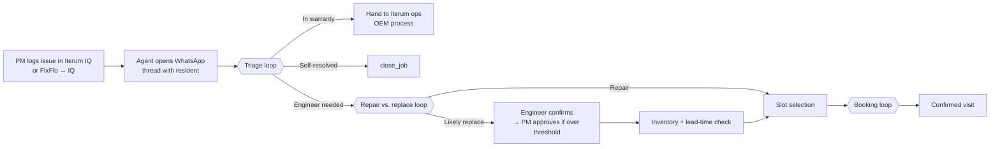
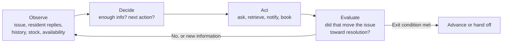

# Iterum Issue Resolution Agent — PRD
### Module 1: Design & Prototype Your AI Agent

**Author:** Emma Witherington, Head of Product & Tech, Iterum
**Status:** v3 — working draft, will evolve across the course

*Changes in v3 (Module 2): appliance types in scope now enumerated (§6); shared-responsibility notice added as a core logic spec (§5.4) and a guardrail (§7); escalation handling and ops ingest specified (§5.5); repair-vs-replace confidence threshold given a working value (§8).*

**Objective:** Take a resident from a reported appliance fault to one of three outcomes — resolved by guided self-troubleshooting, a booked technician visit, or handed to Iterum ops (in-warranty and edge cases) — with the entire resident conversation happening in WhatsApp.

---

## 1. Problem

When an appliance breaks, nobody in the chain knows what's actually wrong with it. Today that means paying an engineer to attend just to diagnose, and often a second visit to actually fix it. Residents wait; property managers pay for callouts that a two-minute troubleshooting step would have avoided; Iterum ops absorbs the coordination.

Three specific failure points this agent targets:

1. **No triage before dispatch.** Phone triage with an engineer works but doesn't scale — it spends the scarcest resource (engineer time) on issues that mostly don't need one.
2. **Under-informed first visits.** When a visit is genuinely needed, it's booked without the context that would let the engineer resolve it in one trip.
3. **Manual scheduling and follow-up.** Slot matching, reschedules, and access questions all run through ops over SMS today (TextMagic, manually read and answered). This doesn't hold as volume grows.

**Why it's worth solving:** faster resolution, fewer avoidable callouts, and less ops load — against baselines of 93% first-time fix and 4-day average resolution (industry: ~70% and 10–20 days). Every triage conversation and engineer confirmation also feeds Iterum's data layer, which is the compounding part.

**Why an agent rather than a workflow:** the resident journey is broadly linear, but three points inside it require interpreting ambiguity and choosing a next action based on what comes back — how to troubleshoot this specific fault, whether it's repair or replace, and how to land a slot the resident will actually accept. Those are loops, not steps (§3.2).

---

## 2. Users

| User | Channel | Role in the flow |
|---|---|---|
| **Resident** *(primary)* | WhatsApp | Confirms/corrects the issue, attempts guided troubleshooting, accepts or rejects the proposed slot |
| **Property Manager (PM/FM)** *(secondary)* | Email (Mailgun) | Logs the issue into Iterum IQ; approves replacements above cost threshold |
| **Iterum engineer** *(secondary)* | WhatsApp / Airtable notification | Confirms or overrides the replacement recommendation pre-visit |
| **Iterum ops** *(secondary)* | Airtable / Iterum IQ | Receives parts-order requests and warranty handoffs; the agent never orders anything itself |

---

## 3. The Agent

### 3.1 Journey spine

Issues enter via PM logging into Iterum IQ (or FixFlo → IQ), which triggers the agent to open a WhatsApp thread with the resident. Resident-initiated reporting is explicitly out of scope.



### 3.2 The loops

The journey above is mostly linear. The intelligence sits in three embedded loops, each running the same cycle until an exit condition is met:



| Loop | Observes | Exits when |
|---|---|---|
| **Triage** | Resident replies, appliance record, warranty status, similar past issues | Issue self-resolves → close; in warranty → ops; enough signal for a repair/replace call; or resident unresponsive |
| **Repair vs. replace** | Triage transcript, appliance age, comparable job outcomes | Confidence threshold met on repair → schedule; likely replacement → engineer confirmation |
| **Booking** | Proposed slot, resident accept/reject, parts lead time | Resident accepts → confirm; after N rejections → hand to ops |

### 3.3 Capabilities

| Capability | Receives | Decides | Does | Produces |
|---|---|---|---|---|
| **Triage** | Issue record, resident description, photos | What to ask next; which troubleshooting steps fit this fault; whether it's resolved | Confirms issue details, checks warranty and history, walks the resident through steps in WhatsApp | Structured issue detail + triage transcript, or a closed job |
| **Decision analysis** | Triage output, appliance history, comparable issues | Repair vs. replace, with confidence — framed as provisional routing, never a guaranteed diagnosis | Forms and logs the hypothesis | Recommendation + rationale, logged against what the engineer later finds |
| **Scheduling** | Routing decision, property/engineer data, stock and lead time | Which single slot to propose; whether parts push the earliest viable date | Checks inventory, requests parts via ops if short, finds and proposes a slot, books on acceptance | Confirmed visit in Iterum IQ |
| **Approvals** *(replacement path only)* | Recommendation, estimated cost | Whether the cost clears the PM threshold | Notifies engineer to confirm; if over threshold, emails PM for approval | Logged confirmation and/or approval, gating the booking |

### 3.4 Autonomy and human gates

- **Repair path — fully autonomous.** Triage, recommendation, slot proposal, and booking run without a human. Worst case is an engineer attending a job that turns out to need a replacement, which is today's baseline anyway.
- **Replacement path — sequentially gated.** Engineer confirms or overrides the recommendation first; if estimated cost is over the PM threshold, PM approval is then requested by email. Booking waits on both. This matches Iterum's own stance that Decision Analysis stays recommendation-only, with mandatory override logging, until the model earns trust.
- **Parts and inventory — read, notify, never order.** The agent reads Airtable stock, and where parts are short it asks ops to order and adds the lead time to the earliest viable slot. Ops executes.
- **Warranty — always a handoff.** In-warranty jobs exit the automated flow (§5.2).

---

## 4. System Architecture

Frontend and backend layers are out of scope for this module.

### 4.1 Model layer
A single LLM agent (Claude, via the Claude Agent SDK) runs the loops: triage dialogue, troubleshooting-step generation, and the repair-vs-replace assessment. Both reasoning-heavy calls have a rules-based fallback — a lookup of common fault patterns per appliance type, and a simple age/cost heuristic — so the system degrades gracefully and can be A/B'd against the LLM path later.

The per-appliance fault-pattern reference files built in Module 2 are the source of truth for both paths: the reasoning call reads them as skill context, and the fallback uses the same tables as a lookup. One source, so the two cannot drift apart.

### 4.2 Data and context
Prototype runs on a mocked layer mirroring Iterum IQ's real visits-nested-within-issues model, so logic transfers if it's ever pointed at production: `Resident`, `Property`, `Appliance` (incl. install date, brand, warranty), `Issue` (description, photos, triage transcript, recommendation, confidence, engineer override), `Visit`, `Engineer` (property assignment, service days), `InventoryItem` (stock, lead time), `Approval`, `ConversationLog`.

### 4.3 Tool calls

| Tool | Purpose | System |
|---|---|---|
| `send_resident_message(resident_id, message)` | All resident communication, one thread per issue | **WhatsApp Business API** |
| `get_appliance(appliance_id)` | Make, model, install date, prior issues | Iterum DB |
| `check_warranty(appliance_id)` | In/out of warranty, OEM, expiry | Iterum DB |
| `search_similar_issues(appliance_type, issue_description)` | Comparable past jobs and their outcomes | Iterum DB |
| `get_triage_steps(appliance_type, brand, issue_description)` | Resident-safe troubleshooting steps for this fault | LLM reasoning call *(fallback: fault-pattern lookup)* |
| `assess_repair_vs_replace(appliance, issue_description, triage_attempts, history)` | Recommendation + confidence | LLM reasoning call *(fallback: age/cost heuristic)* |
| `get_property_data(property_id)` | Assigned engineer, service days, access notes | Iterum DB |
| `check_inventory(sku)` | Stock on hand and lead time | **Airtable API** (ops-maintained stock tracker, read-only) |
| `send_ops_message(issue_id, request)` | Request a parts order; flag warranty handoff | Airtable API / Iterum IQ |
| `find_available_technician(property_id, earliest_date)` | Next qualifying slot for the property's engineer | **Airtable API** (ops/FSM source of truth today) |
| `send_engineer_message(engineer_id, recommendation)` | Pre-visit confirm/override request | WhatsApp / Airtable notification *(channel TBD)* |
| `send_email(pm_email, subject, body)` | PM cost approval — the one point the flow leaves WhatsApp | **Mailgun API** |
| `book_visit(issue_id, slot, visit_type)` | Creates the visit | Iterum IQ API |
| `confirm_visit(visit_id)` | Locks the slot once the resident accepts | Iterum IQ API |
| `close_job(issue_id, resolution)` | Closes self-resolved jobs | Airtable API → syncs to IQ |

*Deferred:* `search_manuals()` against a vector DB of OEM manuals — Iterum doesn't store manuals today; worth revisiting once the core system works.

### 4.4 Infrastructure
Claude Agent SDK, one agent session per issue thread, local state (SQLite or JSON) standing in for IQ/Airtable. No auth, multi-tenancy, or deployment in scope.

---

## 5. Core logic specs

**5.1 Slot selection.** Deterministic in v1:

```
earliest_date = today + parts_lead_time_days   (0 if in stock)
slot = first available appointment on a day the property's assigned
       engineer already services that property, on or after earliest_date
```

One slot is proposed at a time. On rejection, the agent offers the next qualifying slot; after three rejections it hands the thread to ops. Route optimisation, cross-property engineer pooling, and preference learning are the next version of this — deliberately not v1.

**5.2 Warranty branch.** `check_warranty()` runs during triage because the answer changes everything downstream: in-warranty repairs must be activated and managed through the OEM, who dispatches their own engineer. The agent does not book, quote, or schedule these. It notifies ops via `send_ops_message()`, tells the resident their issue is being handled by the manufacturer's service process, and closes its own loop. Automating the OEM process is a 2027 item on Iterum's roadmap.

**5.3 Parts and inventory.** `check_inventory()` before proposing a slot. If short, `send_ops_message()` requests the order and the lead time is added to `earliest_date`. The agent never places an order.

**5.4 Shared-responsibility notice.** Triage is only as good as what the resident reports back. The failure mode this addresses is specific: a resident reports a step as completed when it was not, the agent routes to an engineer on that basis, and the engineer attends to find the exact fix the agent had already described.

The agent sends a single fixed notice — after the fault is confirmed, before the first troubleshooting step — stating that where a step is reported as completed but was not, and a visit finds it was a simple fix, the cost of that visit may be charged to the resident, and that questions should go to the property manager or onsite team. A one-tap acknowledgement is offered via a WhatsApp interactive button and logged with a timestamp, but no response is required and triage proceeds either way.

Constraints: the notice is sent once per issue, never repeated, and never raised again after a visit. The agent does not state that a charge will be made, name an amount, or decide whether the circumstances apply — any charging decision belongs to the PM, who holds the tenancy terms. The notice is suppressed where an escalation is active, where a vulnerability flag is set, where the resident has declined to troubleshoot, or where triage routes straight to an engineer without proposing steps. A resident who disputes the notice moves into the dispute-escalation path.

**5.5 Escalation handling.** Two response modes, because not everything needing a human needs the conversation to stop.

*Halt* — the agent stops, sends a short stop message, notifies ops, and does not resume without a human. Used for safety emergencies, safeguarding concerns or an explicit request for a person, requests that would commit Iterum on cost or fault, property damage and injury, and the agent's own uncertainty.

*Flag and continue* — the agent notes what it saw, notifies ops for awareness, sets any flag that should persist onto the record, adjusts its behaviour, and carries on resolving the issue. Used for resident distress and disclosed vulnerability short of safeguarding, and for out-of-scope questions.

The distinction exists because halting is not always the kinder option: a resident who is struggling and has been without an appliance for weeks is better served by faster resolution with a human aware than by a callback promise. It also protects the product's purpose — resident communications routinely involve complaints, and an agent that treats dissatisfaction as a stop condition hands ops the work it was built to absorb. The test for the cost-and-liability category is therefore narrow: does the agent's next message commit Iterum to a position on money, fault or the tenancy?

**Ops ingest (MVP).** `send_ops_message()` posts to an ops Slack channel via an incoming webhook, carrying the issue reference, property and unit, resident name, category, the trigger verbatim, conversation state, and deep links to the issue in IQ and to the WhatsApp thread. Halt and flag notifications are visually distinct. The intended outcome is that ops joins the resident's existing WhatsApp thread — no channel switch and no repetition for the resident.

This creates one hard requirement: **thread ownership**. Once a human is in the thread the agent must not post to it again, so a `human_in_thread` state silences the agent and is cleared only by an explicit ops action. It must be checked before every outbound message, not only at escalation time, because in flag-and-continue mode the agent is still working when ops may step in.

Accepted for now, at current volume: no acknowledgement loop, no out-of-hours path, no prioritisation, no structured post-hoc review. Conditions for revisiting each are recorded alongside the escalation skill.

---

## 6. Scope

**Appliance types in scope (v1):** oven, hob (gas, ceramic and induction — treated separately from oven), fridge-freezer, washing machine, washer-dryer, tumble dryer, dishwasher, extractor hood, microwave, wine cooler. Each has a fault-pattern reference file backing both the triage reasoning call and its rules-based fallback. An appliance type without a reference file is handed to ops rather than triaged.

| In scope (v1) | Out of scope | Next version |
|---|---|---|
| WhatsApp triage conversation with guided troubleshooting | Resident-initiated issue reporting | More agentic technician assignment (route optimisation, cross-property pooling) |
| Self-resolution → `close_job()` | Formal escalation queue — prioritisation, acknowledgement, out-of-hours cover | Provisional booking held in parallel with approvals |
| Repair vs. replace recommendation | Post-visit closure, technician notes, IQ↔Yardi sync | Manuals / knowledge-base retrieval |
| Sequential engineer → PM approval gate | Invoicing, PO, reporting, predictive maintenance | Proactive FM exception alerting |
| Inventory read + ops parts request | Automated parts ordering or reordering | |
| Single-slot proposal, accept/reject, booking in IQ | OEM warranty automation | |
| Warranty check + ops handoff | | |
| Shared-responsibility notice + acknowledgement logging | Any charging or recharge workflow — PM-side, not agent-side | |
| Escalation handling — halt / flag-and-continue, Slack notification to ops | | |

---

## 7. Guardrails and success metrics

**Guardrails**
- Recommendations are stated as provisional routing, never as a certain diagnosis.
- Troubleshooting steps must be resident-safe: no electrical work, no disassembly, nothing requiring tools beyond the obvious. Gas appliances are restricted to registered engineers by law and get no resident troubleshooting at all.
- The shared-responsibility notice (§5.4) is the single, narrow exception to the rule that the agent never raises liability. It is a fixed message sent once; the agent never asserts that a charge applies, and never revisits it.
- Where the agent hits something it can't competently handle — an apparent emergency, property damage or injury, a request to commit Iterum on cost or fault — it says so plainly and stops rather than improvising (§5.5). Ordinary complaints are not a stop condition; the agent handles them and keeps working.
- Every recommendation, engineer override, approval, and notice acknowledgement is logged. That log is the dataset that eventually validates the model.

**Metrics**

| Metric | Baseline | Target direction |
|---|---|---|
| Issues resolved without a visit | Not tracked | Establish baseline — the clearest cost proof point |
| First-time fix rate | 93% | Maintain or improve via better-informed visits |
| Average resolution time | 4 days | Reduce |
| Ops touches per issue | Manual today | Reduce toward zero on the standard path |
| Recommendation accuracy vs. engineer finding | No model in production | Establish — requires override data to accumulate |
| Avoidable callouts (visit finds a fix triage had already proposed) | Not tracked | Establish — the measure §5.4 exists to move |

---

## 8. Open questions and build plan

**Open**
- PM cost-approval threshold — needs a number (configurable placeholder for the prototype).
- Engineer notification channel — WhatsApp or Airtable.
- Shared-responsibility notice wording — needs legal review before production, and confirmation that it is consistent with the tenancy terms Iterum's clients operate under.
- Fault-pattern reference files are drafted from general industry knowledge and need engineer validation and supplementation with Iterum's own service data.

**Settled since v2**
- Repair-vs-replace confidence threshold: working value of 0.7. At or above, a repair recommendation routes autonomously; below, it still books but the engineer brief leads with the uncertainty. Replacement recommendations go to the engineer gate at any confidence.
- Triage unresponsive handling: chase at 24h, ops handoff at 48h.
- Escalation is two-mode (halt / flag-and-continue) rather than always halting, and ordinary complaints are explicitly not a trigger.
- Ops escalation ingest for MVP: Slack webhook into an ops channel, with ops taking over the resident's existing WhatsApp thread.
- Cracked hob glass is a determinative replacement at any age, but still routes through engineer confirmation rather than booking a replacement directly.

**Build order**
1. Mock data layer + tool stubs.
2. Triage loop end to end, including self-resolution and the warranty branch.
3. Repair path: recommendation → inventory → slot → book → confirm.
4. Replacement path: engineer confirmation → PM approval gate.
5. Test scenarios: clean self-fix, clear repair, likely replacement, in-warranty, parts-delayed, resident rejects twice.
